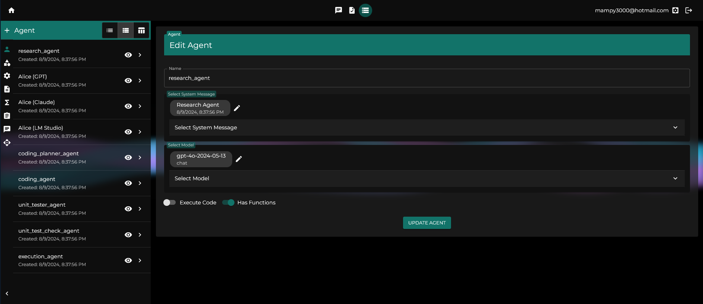
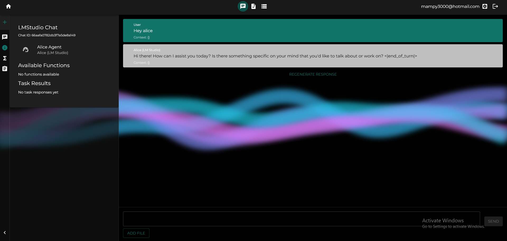
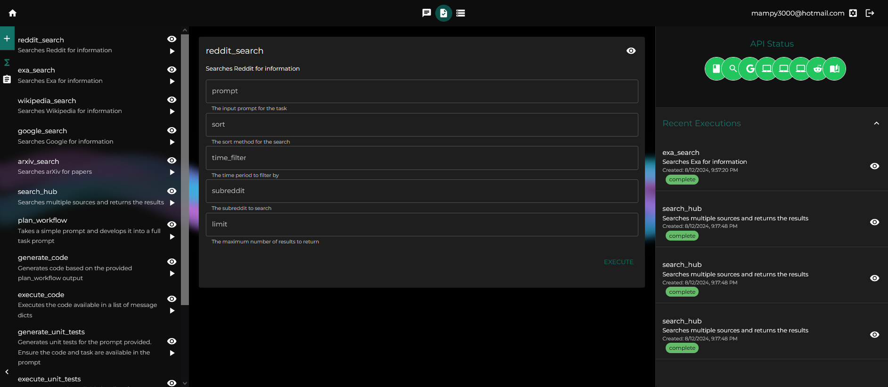
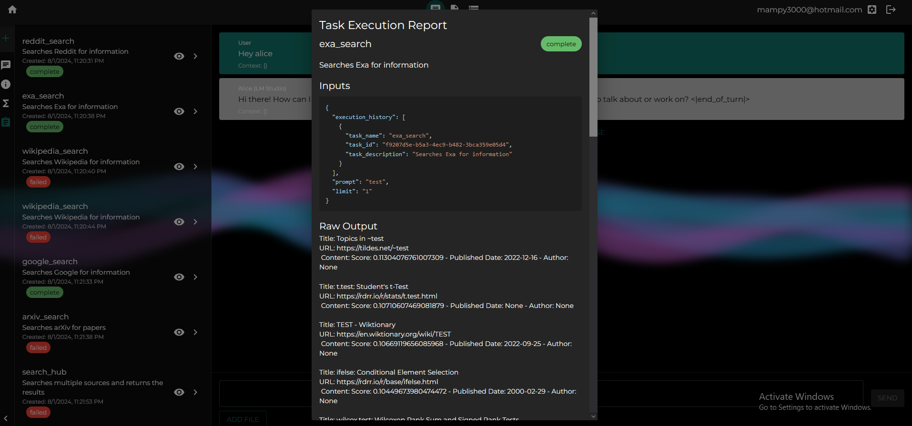

# Alice: Advanced Language Intelligence and Cognitive Engine


Alice is a sophisticated AI assistant framework that integrates task execution and intelligent chat capabilities. It provides a flexible environment for creating, managing, and deploying AI agents for various purposes, leveraging a microservices architecture with MongoDB for data persistence.

## Project Structure

The project consists of three main components:

1. Backend (Node.js with Express - TS)
2. Workflow (Python - Pydantic)
3. Frontend (React - TS)

## The Goal
1. Provide a tool to create, test and deploy agentic solutions
2. A framework where 'text' is the primary input and the output of most operations, with the goal of making this tool 'human languange readable', allowing agents to not only execute complex workflows, but create new ones, and not requiring in-depth technical expertise in order to create complex and powerful workflows. 
3. Produce a framework that is model-agnostic/brand-agnostic, allowing the user to set and deploy their solutions however they want
4. Maybe one day, this or a similar solution can offer an open-source option that helps put the control in the users hand, even in an AI-powered world. 
5. The bet here is that in a world where agentic solutions are able to tackle more problem types and more complex ones, a key value add is to be the expert in converting expertise into automated workflows: then, knowing how to perform a task is less important than knowing how to perform a task an infinite amount of times. 

## How it works


The framework is based around 4 main components:
- APIs and their engine
- Agents, which deploy prompts and use LLM API
- Tasks that leverage agents and other API types to produce an output (Task Response)
- Chats, that leverage tasks and agents, to produce a conversational experience, generating messages (MessageDict)

## Features

### 1. Task Execution
- Create and execute custom tasks using predefined classes or by creating new ones in the Workflow module
- Define new parameters, prompts/templates, and agents for task deployment
- Execute tasks with custom parameters directly
- Supported task types include:
  - Workflow
  - API tasks: Reddit, Wikipedia, Google, Exa, and Arxiv search
  - Agentic tasks:
    - BasicAgentTask: Including CodeExecutionLLMTask
    - PromptAgentTask: Including CheckTask and CodeGenerationLLMTask

### 2. Intelligent Chat
- Create and manage chat conversations with AI agents
- Add task results from the database to ongoing conversations
- Integrate new tasks as tools for the active agent during chat
- Support for various message types (text, image, video, audio, file)

### 3. Extensible Framework
- Modular architecture allowing easy addition of new components
- Flexible integration of external APIs and models
- Support for multiple AI models, including local and remote deployments

### 4. User Management
- User authentication and authorization
- Role-based access control (user and admin roles)

### 5. Flexible Model Deployment
- Deploy local models using LM Studio
- Use OpenAI-compatible endpoints or Anthropic models to power your agents and workflows

## Setup and Installation

1. Ensure you have Docker installed on your system.

2. (Optional) Install LM Studio if you plan to use local models.

3. Download the repository:
   ```
   git clone https://github.com/MarianoMolina/project_alice.git
   ```

4. Create a `.env` file in the root directory using the `template.env` file as a reference. Complete the data for any APIs you want to use (e.g., OpenAI API key).

5. Run the appropriate script for your operating system:
   - Windows: Run `run.bat`
   - Linux/Mac: Run `run.sh`
Alternatively you can just execute run.py using `python run.py` in a commandline while in the repository folder

This will build and launch the containers. Once ready, the frontend will be accessible at `http://localhost:4000/`.

## Usage

The Alice framework provides a user-friendly frontend interface for interacting with the system. Through this interface, you can:

1. Create and manage AI agents, models, prompts, parameters, tasks, api, etc. in your personal database

2. Start and manage chat conversations

3. Create and execute various types of tasks

4. View and analyze task results

5. Manage user accounts and permissions, api config, etc. 

### Types of Tasks

1. API Tasks: These tasks don't use an LLM model, but instead other types of APIs to produce information. Each has their input structure, but usually take a str prompt and an int max_results: 
   - Google Search
   - Exa Search
   - Reddit Search
   - Wikipedia Search
   - Arxiv Search

2. Agentic Tasks:
   - BasicAgentTask: General-purpose tasks executed by an AI agent. Takes a list of messages as input. If the task has other tasks available, the agent can use those tasks as tools. 
   - PromptAgentTask: Tasks that deploy templated prompts, allowing the inputs to be a string ({{ prompt }} is the basic task prompt) instead of a list of messages. 
     - CheckTask: For validating or checking specific conditions - it checks for strings in the output, and converts that into a discrete result (0, 1, etc)
     - CodeGenerationLLMTask: For generating code based on prompts - it validates that it's returning a valid code block
     - CodeExecutionLLMTask: For executing code snippets

3. Workflows:
   - Combine multiple tasks into a sequential or conditional flow
   - Define complex processes involving multiple agents and task types, check tasks, api tasks, agents with tools, etc. 


## Development

### Adding New Task Types

1. Create a new task class in the Workflow module, extending the `AliceTask` base class.
2. Implement the `run` method to define the task's behavior.
3. Add the new task type to the `task_type` enum in the `task.model.ts` file.
4. Update the task creation logic in the frontend to include the new task type.

### Adding New API Types and API Names

1. Update the `ApiType` and `ApiName` enums in the backend and workflow containers.
2. Implement the necessary logic in the workflow container to handle the new API type.
3. Update the frontend to support the new API type in the API management interface.

For detailed instructions on adding new API types and names, refer to the backend and workflow README files.

### Adding New Models, APIs, Tasks, Chats, Agents

1. Navigate to the Database page in the frontend and select the entity type you want to create and click on create new.
2. To add new entities that will be available to new users, you can modify the workflow initialization modules:
   - Locate the `workflow_logic/db_app/initialization/modules` directory in the workflow container.
   - Create a new module file or modify existing ones to include your new entities.
   - Update the `modular_db` in `workflow_logic/db_app/initialization/data_init.py` to include your new module.

For more detailed information on creating and managing initialization modules, refer to the workflow container README.

## Contributing

Contributions are welcome! Please follow these steps:

1. Fork the repository
2. Create a new branch: `git checkout -b feature-branch-name`
3. Make your changes and commit them: `git commit -m 'Add some feature'`
4. Push to the branch: `git push origin feature-branch-name`
5. Submit a pull request

If you've created new tasks, workflows, or initialization modules that you'd like to share with the community, please include them in your pull request along with appropriate documentation. We're particularly interested in contributions that expand the capabilities of the workflow initialization process, allowing users to start with a richer set of pre-configured entities.

## Future Features

Where is Project Alice going:

1. **Workflow generator**: Improve the interface for workflow generation. Ideally, something that allows the user to handle tasks/nodes, visualize the execution of it, etc. 

2. **More API engines and base tasks**: BeautifulSoup to scrap websites, vision_models, text_to_image_models, text_to_speech_models, etc. This will enable a new set of tasks to be created. 

3. **File input and type interface**: Being able to add files of any type to a conversation, which makes a conversion to text of the file (stt, itt, or simply parsing for files that can be converted to a string), allowing for the user and the agents to share any type of data. This, in turn, requires the agents to also be able to produce different types of outputs, which is where the type interface logic comes in, to convert str -> any and back. 

4. **Complex Agent Structures**: Implementation of more advanced agent architectures, such as ReAct and RAG agents, to enable more sophisticated reasoning and decision-making capabilities.

5. **Work Environments**: Introduction of a feature similar to Anthropic's Artifacts, providing a more structured way to manage and interact with complex data and tools within the Alice ecosystem. Idea is to use a mix of in-context and RAG-powered sources, that the user is actively able to update, trim, etc. to ensure the correct info is available at the right time. 

6. **Journals**: Development of a holistic view of conversations and interactions, enabling the creation of workflows that run periodically. This feature will support tasks such as:
   - Reviewing and summarizing emails
   - Tracking and updating calendar events
   - Monitoring and responding to messages across various platforms
   - Reviewing and updating goal statuses
   - Generating periodic reports and insights
   - Updating RAG-sources

7. **Improvements and fixes**: There are 3 areas I think are crucial in the mid-term to tackle:
   - Edge-case analysis
   - Improve error handling and logging


## License

This source code is licensed under the BSD-style license found in the
LICENSE file in the root directory of this source tree. 

## Contact

For support or inquiries, please contact mampy3000@gmail.com