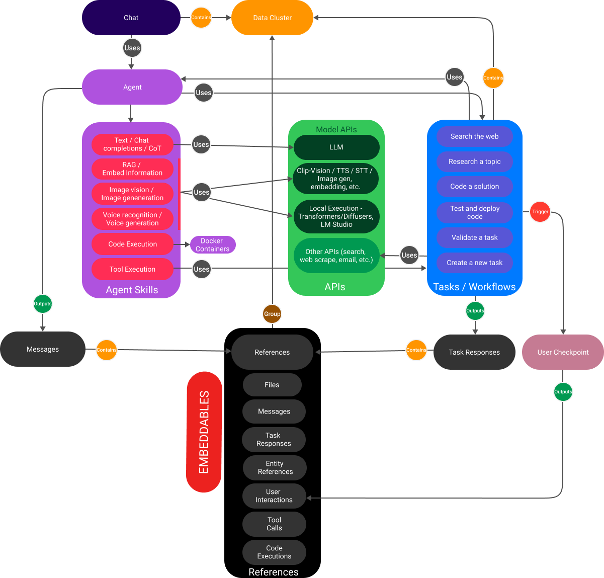
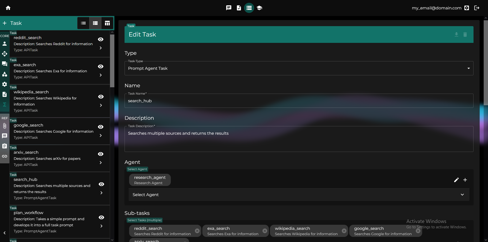
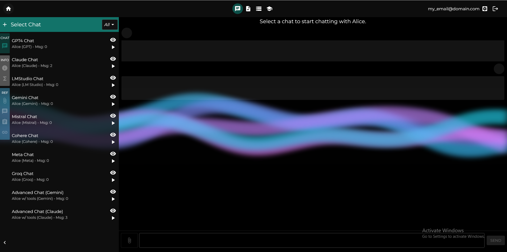
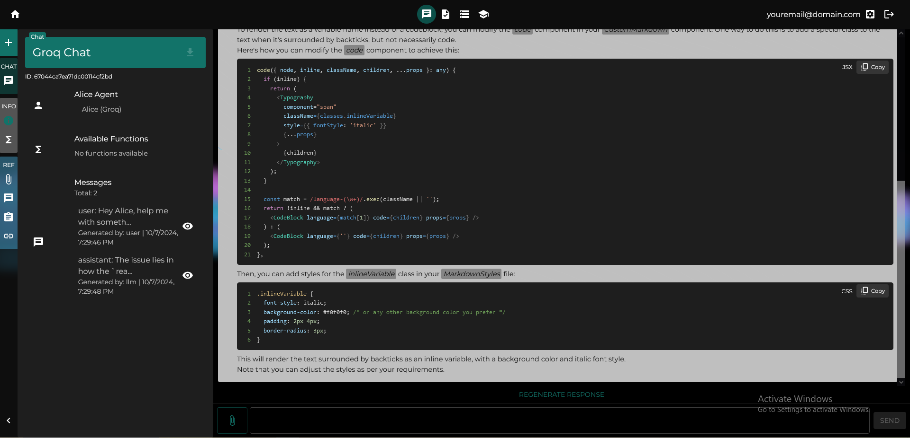
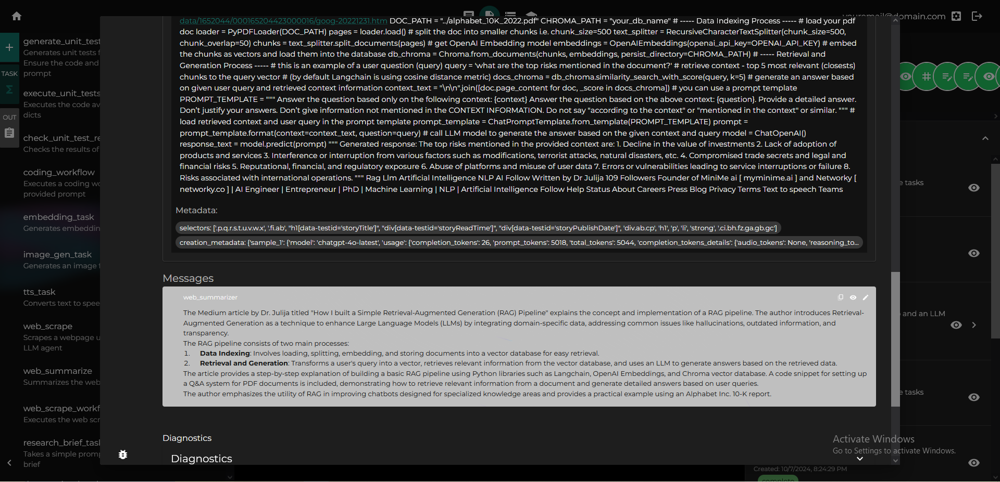

# Alice: Advanced Language Intelligence and Cognitive Engine
*Version 0.3 (alpha)*


Alice is an agentic workflow framework that integrates task execution and intelligent chat capabilities. It provides a flexible environment for creating, managing, and deploying AI agents for various purposes, leveraging a microservices architecture with MongoDB for data persistence.

> What's new? v0.3 brings:
> - RAG: Support for RAG with the new Retrieval Task, which takes a prompt and a Data Cluster, and returns chunks with highest similarity. It can also be used to ensure a Data Cluster is fully embedded. 
> - HITL: Human-in-the-loop mechanics to tasks -> Add a User Checkpoint to a task or a chat, and force a user interaction 'pause' whenever the chosen node is reached
> - COT: A basic Chain-of-thought implementation: [analysis] tags are parsed on the frontend, and added to the agent's system prompts allowing them think through requests more effectively
> - DOCUMENTS: Alice Documents, represented by the [aliceDocument] tag, are parsed on the frontend and added to the agent's system prompts allowing them to structure their responses better
> - NODE FLOW: Fully implemented node execution logic to tasks, making workflows simply a case where the nodes are other tasks. This allows for greater clarity on what each task is doing and why
> - FLOW VIEWER: Updated the task UI to show more details on the task's inner node logic and flow
> - PROMPT PARSER: Added the option to view templated prompts dynamically, to see how they look with certain inputs, and get a better sense of what your agents see
> - APIS: New APIs for Wolfram Alpha, Google's Knowledge Graph, PixArt Image Generation (local), Bark TTS (local). Support for local embeddings
> - DATA CLUSTERS: Now chats and tasks can hold updatable data clusters that hold embeddable references like messages, files, task responses, etc. You can add any reference in your environment to a data cluster to give your chats/tasks access to it. The new retrieval tasks leverage this. 
> - TEXT MGMT: Added 2 Text Splitter methods (recursive and semantic), which are used by the embedding and RAG logic (as well as other APIs with that need to chunk the input, except LLMs), and a Message Pruner class that scores and prunes messages, which is used by the LLM API engines to avoid contex size issues
> - **NOTE**: If you update to this version, you'll need to reinitialize your database (User settings -> Danger Zone). This update required a lot of changes to the framework, and making it backwards compatible is inefficient at this stage. Keep in mind Project ALice is still in Alpha, and changes should be expected

> What's next? Planned developments for v0.4 (find detailed info below):
> - Agent using computer
> - Communication APIs -> Gmail, potentially messaging
> - Recurring tasks -> Tasks that run periodically, accumulating information in their Data Cluster
> - CUDA support for the Workflow container -> Run a wide variety of local models, with a lot more flexibility
> - Testing module -> Build a set of tests (inputs + tasks), execute it, update your tasks/prompts/agents/models/etc. and run them again to compare
> - Context Management w/LLM -> Use an LLM model to (1) summarize long messages to keep them in context or (2) identify repeated information that can be removed

## Project Structure

The project consists of three main components:

1. Backend (Node.js with Express - TS) -> Manages the MongoDB, io generations and the file system, including serving files for the frontend. 
2. Workflow (Python - Pydantic) -> Handles (most) of the logic, interacts with external APIs, consumes the Database through the Backend, and reads from the file system. Main endpoints are task execution and chat response generation. 
3. Frontend (React - TS) -> UI that consumes/interacts with the DB and file system through the Backend and calls Workflow's endpoints to trigger executions. 


## The Goal
1. Provide a tool to create, test and deploy agentic solutions
2. A `human-language` framework where text is the primary input and the output of most operations, with the goal of making this tool easy to engage with by both users and agents
3. Produce a model-agnostic/brand-agnostic framwork, allowing the user to set and deploy their solutions however they want
4. Offer an open-source option that helps put the control in the users hand 

## Setup and Installation

> *Installation and platform overview videos: [Part 1](https://www.youtube.com/watch?v=ojhcb9ADJqU) - [Part 2](https://www.youtube.com/watch?v=oXGk6g_gPtU)*

1. Ensure you have Git and [Docker installed](https://docs.docker.com/engine/install/) on your system. On Windows, once you do, it comes with the docker-compose plugin installed by default, but [check if you have it installed](https://stackoverflow.com/questions/72928891/how-can-i-check-if-docker-compose-plugin-is-installed). Otherwise (if in Linux for example), [install it](https://docs.docker.com/compose/install/linux/). If for whatever reason the starting script doesn't start Docker (can't find it), all you need to do is open your Docker app. 

2. (Optional) [Install io](https://lmstudio.ai/) if you plan to use local models. If you don't, you'll see some errors regarding this, but don't worry, everything else will work normally. 

3. Download the repository:
   ```
   git clone https://github.com/MarianoMolina/project_alice.git
   ```

4. Create an `.env` file in the root directory using the `template.env` file as a reference. Complete the data for any APIs you want to use (e.g., OpenAI API key). Even if you don't update anything, if you don't create it / copy it, the build process will fail. 

5. Run the appropriate script for your operating system:
   - Windows: Run `run.bat`
   - Linux/Mac: Run `run.sh`

Alternatively you can just execute run.py using `python run.py` in a commandline while in the repository folder

This will build and launch the containers. Once ready, the frontend will be accessible at `http://localhost:4000/`. 

> If you see an error during the installation related to `403  connecting to archive.ubuntu.com` or `ETIMEDOUT`, just run it again. Sometimes Docker has an issue installing an image due to connection errors. 

> **NOTE**: If you want to update, run `python update.py`

## Framework



The framework is based around 4 main components:
- APIs and their engine
- Agents, which deploy prompts and have models for any API they want to use
- Tasks that leverage agents, other tasks and APIs to produce an output
- Chats, that leverage tasks and agents, to produce a conversational experience

These components share information in one of 6 main ways, all of which have a string representation:
- Files (All file types have a method for generating a 'transcript' for the file, and files generated through prompts keep it as a representation)
- Messages
- Task Results
- Entity References
- User Interactions
- Embeddings

## Features

### 1. Task Execution
- Create and execute custom tasks using predefined classes or by creating new ones in the Workflow module
- Define new parameters, prompts/templates, and agents for task deployment
- Execute tasks with custom parameters
- Run tasks directly from the frontend, or programatically with the workflow container's API
- Supported task types include:
  - Workflow -> Combine other tasks
  - API tasks: Reddit, Wikipedia, Google, Exa, and Arxiv search -> Retrieve information
  - Agentic tasks:
    - Prompt Agent Tasks: Including the base PromptAgentTask, and CheckTask, CodeExecutionLLMTask and CodeGenerationLLMTask
    - Agent Tasks: WebScrapeBeautifulSoupTask, TextToSpeechTask, GenerateImageTask, RetrievalTask and EmbeddingTask

### 2. Intelligent Chat
- Create and manage chat conversations with AI agents
- Add references from other conversations or task executions to enrich the chat context
- Integrate new tasks as tools for the active agent during chat
- Support for various message types (text, image, video, audio, file) -> automatic transcript is created so the agent can interpret
- Deploy these agents wherever you want, since the workflow API offers an endpoint to create chat completions

### 3. Extensible Framework
- Modular architecture allowing easy addition of new components
- Flexible integration of external APIs and models
- Support for multiple AI models, including local and remote deployments

### 4. User Management
- User authentication and authorization
- Role-based access control (user and admin roles)

### 5. Flexible Model Deployment
- Deploy local models using io
- Use any OpenAI-compatible endpoints (Groq, Mistral & Llama) or Anthropic, Gemini, and Cohere models to power your agents and workflows

### 6. Programatic Access to your Tasks and Chats
- The Workflow container exposes its API to your `http://localhost:8000/`, with routes `/execute_task` and `/chat_response/{chat_id}` as the primary entry points. You'll need the token for validation. 
-  Check the relevant routes files for the prop structure. 

## Usage

The Alice framework provides a user-friendly frontend interface for interacting with the system. Through this interface, you can:

1. Create and manage AI agents, models, prompts, parameters, tasks, api, etc. in your personal database ([Getting Started](./shared/knowledgebase/general/getting_started))

View all the references you've created, like files, messages, task responses, etc:

2. Start and manage chat conversations ([Start Chat](./shared/knowledgebase/general/start_chat))

Select a chat or create a new one, and start interacting with your agents. 

3. Create and execute various types of tasks ([Execute Task](./shared/knowledgebase/general/execute_task))

View their outputs, run them again, change their settings, etc.

4. Manage your user account and api config. 


### How tasks work
All tasks execute a set of "inner nodes", which can be one or more. The execution logic for these nodes is defined by the node_end_code_routing object and the start_node string. The task will execute the start_node node, and then use the routing and the result retrieved, to decide what node to execute next. 

These nodes are, in normal tasks, inner methods that the task calls when executing, and they return a NodeResponse object. These methods are passed all the executed nodes up to now, with their respective NodeResponse objects, allowing each task and each node to decide how to execute and what to return. 

In the case of Workflows, these nodes are "inner tasks" instead of specific methods defined in the class. These are provided in the "tasks" object of the parent Workflow, and they are executed as a normal inner node would. 

> Here's an example of both a workflow and a task, and how they pass and use the data produced:


### Types of Tasks
- `API tasks`: Tasks that use non-model APIs. Examples include the Google, Wikipidia, Arxiv, Exa and Reddit search tasks, and Google's Knowledge graph. Normally have a single 'default' node. 
- `Prompt agent tasks`: Tasks that use prompts and agents. Base functionality is generating an LLM response to a prompt. By default it includes 3 inner nodes: llm_response, tool_calls, and code_execution. This task has some 'child' tasks:
  - `CheckTask`: Task structured to compare the output generated by the agent with the strings in exit_code_response_map. Allows for easy ways to classify things. For example "Respond with WRONG if the answer is flawed, and CORRECT if the answer makes sense" could be used as a gate to know what task to deploy next. By default only uses the 'llm_response' node 
  - `CodeExecutionLLMTask`: Task that takes the input message, retrieves all code blocks and executes them in a docker container. Only uses the code_execution node
  - `CodeGenerationLLMTask`: Task that ensures that the output generated contains at least one codeblock, or fails. Only uses the llm_generation node by default
- Other agent tasks: Sibling task classes to the prompt agent task, that don't use a prompt to template the task, and usually don't use an LLM model, and therefore don't produce llm_generation, tools or code nodes. 
  - `Text-to-speech task`: Takes a string input, and optional voice and speed variables, and returns a file with the speech created using the tts model in the agent. Uses a single 'text_to_speech' node
  - `WebScrapeBeautifulSoupTask`: Takes a URL, retrieves it, takes a string sample of the html to show an agent to create selectors for BeautifulSoup, and then the parsed content is returned. Uses 2 inner nodes, called 'fetch_url' and 'generate_selectors_and_parse'. 
  - `GenerateImageTask`: Takes an image prompt and uses the agent's img_gen model to generate an image based on it. Uses a single 'generate_image' node
  - `EmbeddingTask`: Takes a string and the agent's embeddings model to generate the vector embeddings for the text provided. For now, chunking is done to the max tokens allowed. Uses a single 'generate_embedding' node
  - `RetrievalTask`: 
- `Workflow`: The simplest and most complex task. Simple because all it does is run other tasks. Complex because the options are endless. Main difference is they use the node_end_code_routing to map the logic path between the inner tasks available, starting from the start_node. 

### Available APIs


```typescript
export enum ApiType {
    LLM_MODEL = 'llm_api',
    GOOGLE_SEARCH = 'google_search',
    REDDIT_SEARCH = 'reddit_search',
    WIKIPEDIA_SEARCH = 'wikipedia_search',
    EXA_SEARCH = 'exa_search',
    ARXIV_SEARCH = 'arxiv_search',
    GOOGLE_KNOWLEDGE_GRAPH = 'google_knowledge_graph',
    WOLFRAM_ALPHA = 'wolfram_alpha',
    IMG_VISION = 'img_vision',
    IMG_GENERATION = 'img_generation',
    SPEECH_TO_TEXT = 'speech_to_text',
    TEXT_TO_SPEECH = 'text_to_speech',
    EMBEDDINGS = 'embeddings',
    REQUESTS = 'requests',
}
export enum ApiName {
    OPENAI = 'openai',
    AZURE = 'azure',
    GEMINI = 'gemini',
    MISTRAL = 'mistral',
    COHERE = 'cohere',
    GROQ = 'groq',
    LLAMA = 'llama',
    ANTHROPIC = 'anthropic',
    BARK = 'bark',
    PIXART = 'pixart',
    GOOGLE_SEARCH = 'google_search',
    REDDIT = 'reddit',
    WIKIPEDIA = 'wikipedia',
    EXA = 'exa',
    ARXIV = 'arxiv',
    GOOGLE_KNOWLEDGE_GRAPH = 'google_knowledge_graph',
    WOLFRAM_ALPHA = 'wolfram_alpha',
    LM_STUDIO = 'lm_studio',
    CUSTOM = 'Custom',
}
``` 

## For more details, check the [ReadMe Index](/shared/knowledgebase/index)

## Contributing

Contributions are welcome! Please follow these steps:

1. Fork the repository
2. Create a new branch: `git checkout -b feature-branch-name`
3. Make your changes and commit them: `git commit -m 'Add some feature'`
4. Push to the branch: `git push origin feature-branch-name`
5. Submit a pull request

If you've created new tasks, workflows, or initialization modules that you'd like to share, please include them in your pull request along with appropriate documentation. We're particularly interested in contributions that expand the capabilities of the workflow initialization process, allowing users to start with a richer set of pre-configured entities.

## Future Features / Upgrades / History

1. **Workflow generator** [Done - Upgrading]: Improve the interface for workflow generation. Ideally, something that allows the user to handle tasks/nodes, visualize the execution of it, etc. 
   - [Added 10/24]: Flowchart for workflows
   - [Added 10/24]: Basic route end code editor
   - [Working on]: Adding a "task visualization" logic to the flowcharts, enabling the frontend to display a *parsed* representation of the task, and its nodes, showing the available and required inputs, as they are passed in the flow, as well as task_templates and output_templates to show how the content will be passed 

2. **More API engines and base tasks** [Done - Upgrading]: BeautifulSoup to scrap websites, vision_models, text_to_image_models, text_to_speech_models, etc. This will enable a new set of tasks to be created. This includes adding more providers, like Google, Mistral, etc. 
   - [Added 10/24]: 21 new API providers, with their corresponding models, for a total of 160 distinct entities for you to use. 
   - [Added 10/24]: 2 new workflows -> Web Scrape and Research. 
   - [Added 11/24]: 1 new Task Type (RetrievalTask) and 4 new APIs (Wolfram Alpha, Google's Knowledge Graph, PixArt Image Generation (local), Bark TTS (local))

3. **File input and type interface** [Done]: Being able to add files of any type to a conversation, which makes a conversion to text of the file (stt, itt, or simply parsing for files that can be converted to a string), allowing for the user and the agents to share any type of data. This, in turn, requires the agents to also be able to produce different types of outputs, which is where the type interface logic comes in, to convert str -> any and back. 
   - [Added 9/24]: Image and Sound file support
   - [Added 9/24]: Both generation (TTS and Image Generation) as well as transcription (STT and Image Vision) available

4. **Complex Information Flows** [In Progress]: 
   - Implement more advanced agent tools, such as ReAct and RAG agents, to enable more sophisticated reasoning and decision-making capabilities.
   - Implement interactive workflows, where the agent could either ask for permission, or deploy a request/action conditional to user approval (human in the loop)
   - [Added 11/24]: User Checkpoints and User interactions help define a 'pause' condition for a task and a node router based on user response. Task can now continue executing from a 'pending' task response -> Potentially could implement being able to remove a node, and set the task to continue from a specific node and produce a new task result, which can be useful when updating/improving a workflow, for example
   - [Added 11/24]: Now all tasks execute a set of nodes, with workflows executing inner tasks, and other tasks executing class methods, with the node routing deciding the flow. This simplifies how information is passed during a task execution, since now tasks check if inputs are available in the executed nodes, and passes them to the next node that needs them. 
   - [Added 11/24]: RAG! Semantic and code chunking as methods to split the embeddings into the most relevant chunks, and RAG tasks that take a data cluster and a prompt, and return relevant chunks. 
   - [Working on]: ReAct and Tree-of-thought at inference. 
      - [Added 11/24]: Basic Chain-of-thought implementation
   - [Working on]: Injecting (optionally) user and context information into the agent's system prompt, like browser, user name, etc. 
      - [Added 11/24]: User name is being injected now, and the User Data is being passed into tasks and chats, meaning we can add arbitrary variables to the user account (like general instructions) and retrieve them. 

5. **Work Environments / Data Clusters** [Done]: Introduction of a feature similar to Anthropic's Artifacts but easier to update, edit, modularize, etc., providing a more structured way to manage and interact with complex data and tools within the Alice ecosystem. Idea is to use a mix of in-context and RAG-powered sources, that the user is actively able to update, trim, etc. to ensure the correct info is available at the right time. 
   - [Added 11/24]: AliceDocuments let agents structure information a bit more concisely. This mostly affects the frontend and system prompts of the agents. 
   - [Added 11/24]: Data clusters are a Reference object with any number and types of references, which are embedded and available for retrieval. If a reference is updated, its embedding is also updated. 

6. **Journals**: Development of a holistic view of conversations and interactions, enabling the creation of workflows that run periodically. This feature will support tasks such as:
   - Reviewing and summarizing emails
   - Tracking and updating calendar events
   - Monitoring and responding to messages across various platforms
   - Reviewing and updating goal statuses
   - Generating periodic reports and insights
   - Updating RAG-sources

7. **Improvements and fixes** [In Progress]: There are several misc areas I think are crucial in the mid-term to tackle:
   - Edge-case analysis
   - Lazy-loading on the frontend
   - Context management -> be able to predict the context size of a chat or task instance, prevent extreme cases, etc. 
   - [Improved 9/24] Improve error handling and logging
      - [Added 9/24]: Logging folder, and better logs from all containers
      - [Added 9/24]: Logging managers with levels, allowing for dev and prod setups
   - [Added 10/24]: Context size restrictions for LLM (removes context from the middle of the conversation), TTS (splits the prompt into chunks, and returns a list of files) and embedding (naive split into max chunk size) generations. 

8. **Unify the type files**: Create a single source of truth for types, enums, etc. Either in TS or Python, and the conversion logic to the other.  
   - Gave this a try and ended up hating myself. 

9. **Make modular addition easy**: Ideally, you should be able to sign up to a repository that has a workflow for example, and then be able to 'spawn' it in your current DB. Requires:
   - Module manager -> Select which modules you want to download and/or keep
   - Module integrator -> Select a module to create a fresh version in your DB -> What about removal? Would we want to add a variable to entities to keep track of this? 
   - [Improved 9/24]: Improved the module logic, simplifying it a bit

10. **Cost management**: Currently, the completion metadata is stored, but not much is done with it. Goals are:
   - Good tracking of costs
   - Task cost estimation based on an algorithm and, when it exists, past data to improve the estimation. 
   - Cost/use tracking by API in a clear UI

11. **Local deployment**: Offer more options for local deployment, especially for smaller models like TTS (even RVC), image generation, etc. (local llm, embeddings and vision can already be used with io) 
   - Offer something closer to Automatic111 for img gen. An option I've thought about is having a ComfyUI container with a set of workflows pre-set that work off the box. 

12. **Test Module**: A section in the UI were you can define a test setup for a task (inputs, models, prompts), to help find ideal task setups. 


## License

This source code is licensed under the BSD-style license found in the
LICENSE file in the root directory of this source tree. 

## Contact

For support or inquiries, please contact mampy3000@gmail.com